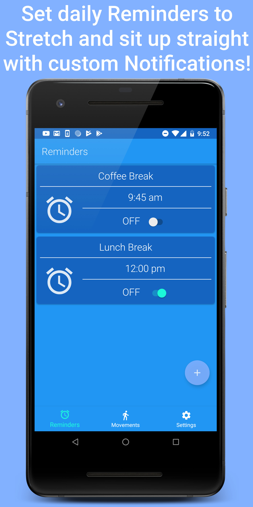
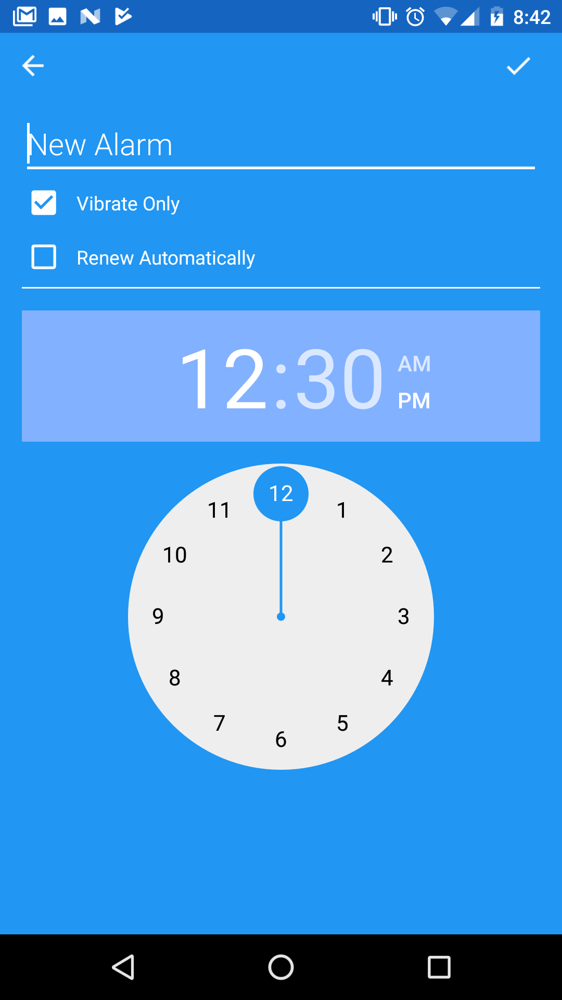
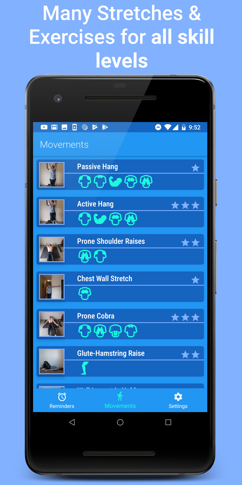
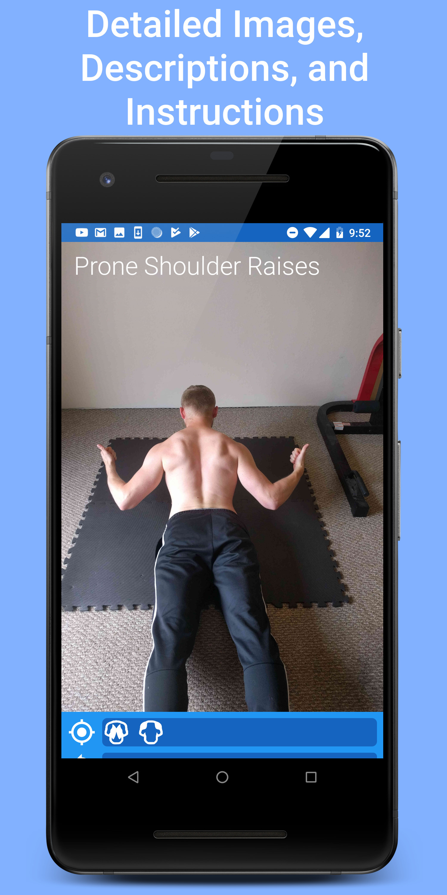
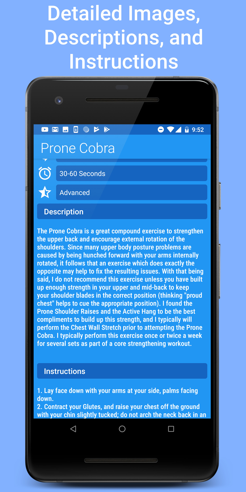
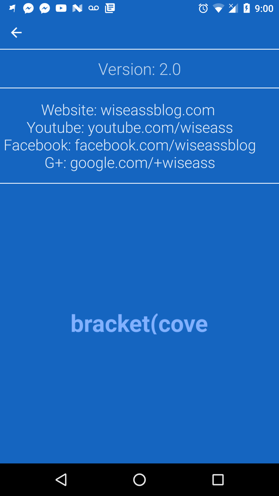

# PosTrainer

## Topics
* [What is PosTrainer?](#what-is-postrainer)
* [Can I use the code?](#can-i-use-code-from-this-repo)
* [Learning Sources/Inspiration](#sources-and-inspiration)

## What is PosTrainer?

PosTrainer is an Notification adn Exercise instruction App which allows the user to set daily reminders to sit up Straight and/or Perform stretches/exercises to combat bad Posture from being a Desk Jockey.

### Reminders Component

### Reminder Detail Component

### Movements Component

### Movement Detail Component

### Settings  Component

## Can I use code from this Repo?
Absolutely, pursuant to the project's [LICENSE](LICENSE.md). I primarily learned how to build Profiler by learning from free sources and referencing open source libraries, many of which I list (here)[#sources]. That being said, the logo (whenever I get around to making it) and name are my intellectual creations, so don't use them unless you are linking/reffering to this Repo.

Follow the rules in the license, and you're good.

## APIs and Architectures Used:
- Android Jetpack/Components: Navigation, ViewModel, LiveData, ConstraintLayout
- Realm for local Persistence
- BroadcastReceiver, AlarmManager, ForegroundService, NotificationManager

The Architecture is my own personal style which I have developed after eventually deciding that I was done calling things names that
did not make much sense to me. That is not to say my names are better, but it is to say that they make more sense to me. If you are actually
interested in learning what Software Architecture means to me without making things needlessly vague nor complex, please read this article:

https://medium.com/datadriveninvestor/programming-fundamentals-part-5-separation-of-concerns-software-architecture-f04a900a7c50

## Sources and Inspiration

Fernando Cejas' Repository and material on Android and Clean Architecture was very useful to me. Being able to see working code is one of the greatest resources, and although I do many things differently (differently, not necessarily better), I don't think I would attempted this without such an awesome reference!

https://github.com/android10/Android-CleanArchitecture

Uncle Bob (Robert C. Martin) explains Clean Architecture in a very practicle and Framework Independent way. You'll want to listen when he speaks on Software Architecture :).

https://www.youtube.com/watch?v=Nsjsiz2A9mg&t=1832s

Martin Fowler eventually broke MVP Architecture into two sub-styles. I currently try to employ "Passive View" as best I can

https://martinfowler.com/eaaDev/PassiveScreen.html

Donn and Kaushik from Fragmented Podcast did an episode on Clean, which also helped my understand a fair bit. Also these guys do an awesome podcast so you should watch it anyway:

http://fragmentedpodcast.com/episodes/11/

